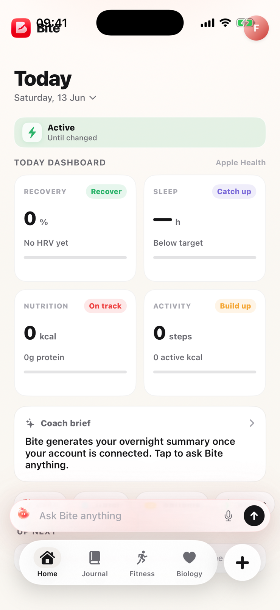
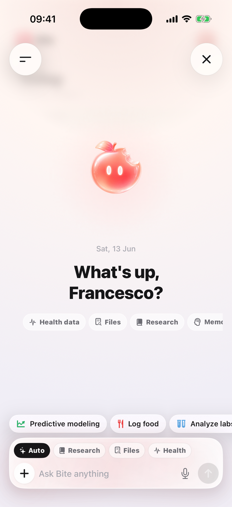
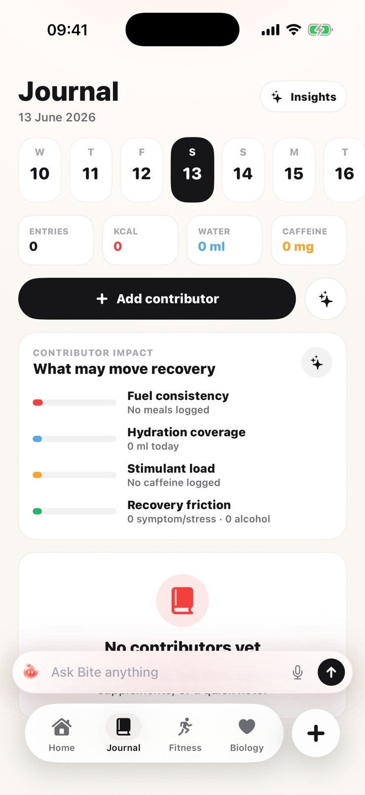
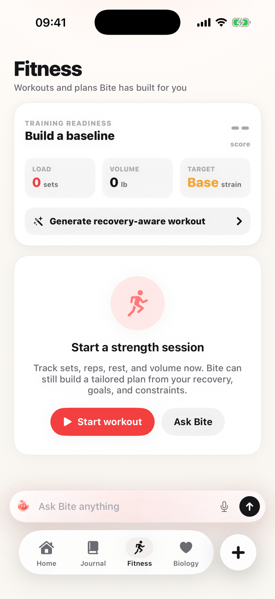
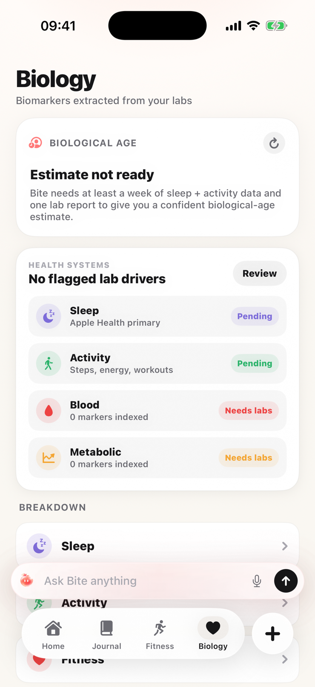

# Bite

**Bite is a proactive AI health coach for iOS.** It connects sleep, heart rate, workouts, nutrition, journaling and lab reports to an agent that learns your personal baseline, starts conversations when something changes, and follows up on its own advice.

Most health apps show you charts and wait. Bite is built around the opposite idea: the coach should notice things first, explain why they matter, and check back later to see if the advice worked.

## Screenshots

| Today | Coach | Journal | Fitness | Biology |
|:---:|:---:|:---:|:---:|:---:|
|  |  |  |  |  |

## What it does

* **Chat with a coach that has your data.** A streaming chat agent with 29 typed tools: it can read your health snapshot, log food from a photo or free text, propose workouts and training plans, track hydration, caffeine, weight and menstrual cycle.
* **Long term memory.** After every conversation turn, a background pass extracts stable facts about you (goals, preferences, barriers), deduplicates them against existing memories with embeddings, and feeds them back as context in future conversations.
* **Scheduled check ins.** The agent can schedule recurring questions ("ask me about sleep at 22:00") that become local alarms on the phone.
* **Lab report understanding.** Upload a PDF or photo of blood work. The pipeline extracts structured biomarkers, stores them encrypted with a per user key, and the coach reasons about them in chat.
* **Biological age.** An estimate computed from biomarkers and habits, with a per factor breakdown.
* **Impact analysis.** Correlates journal tags (alcohol, late meals, stress) with sleep and recovery data from HealthKit, so the coach can say what is actually affecting you.
* **Widgets and Live Activities.** Home Screen widgets for macros, hydration and energy, plus a workout Live Activity on the lock screen and Dynamic Island.

## How it works

Two apps in one repo:

* **iOS app** (`Bite/`, `BiteWidgets/`): SwiftUI, iOS 18+, SwiftData for local persistence, HealthKit for biometrics. Talks to the worker over SSE for streaming chat.
* **Worker** (`worker/`): Cloudflare Worker in TypeScript. Auth (Firebase JWT), the agent loop, tool registry, Drizzle ORM over D1, R2 for encrypted file storage, Vectorize for memory embeddings.

The agent loop is tool based: the model never writes to the database directly. Every action goes through a typed tool (Zod schemas in `worker/src/tools/`), so outputs are auditable and unit testable.

Model routing goes through OpenRouter (`worker/src/llm/router.ts`), so the stack is provider agnostic. Defaults use OpenAI models: GPT 5.5 for reasoning, GPT 5.4 for vision and structured extraction, GPT 5.4 mini for fast cheap passes, and `text-embedding-3-small` for memory embeddings.

A deeper walkthrough of the agent loop, memory, and the lab pipeline is in [`docs/architecture.md`](docs/architecture.md).

## Repository layout

```
Bite/             iOS app source (SwiftUI)
BiteWidgets/      Home Screen widgets + Live Activities
BiteTests/        iOS unit tests
worker/           Cloudflare Worker backend (TypeScript, Drizzle, Wrangler)
design-source/    Raw asset exports (Procreate/Figma), committed for reproducibility
docs/specs/       Design specs for major changes
docs/screenshots/ App screenshots used in this README
SETUP.md          Developer onboarding
```

iOS source lives at the repo root because Xcode project paths are relative to `.xcodeproj`; moving it into `apps/ios/` would risk breaking schemes and build settings for no real gain at this size.

## Running it

iOS: open `Bite.xcodeproj` in Xcode. See [`SETUP.md`](./SETUP.md) for environment setup.

Worker:

```bash
cd worker
npm install
npx wrangler dev
```

Tests: `npm run test` (Vitest, 18 tests covering routing, auth and the chat contract).

## Conventions

* Feature work in `feature/*`, bugfixes in `fix/*`, design overhauls in `design/*`.
* Any change touching multiple components ships with a spec in `docs/specs/` first.
* All user facing strings are English. Italian raw values exist in some `Codable` enums for back compat; views use `.displayName`, never `.rawValue`.

## License

[PolyForm Noncommercial 1.0.0](LICENSE.md). You can read the code and use it for noncommercial purposes. Any commercial use needs my written permission. Copyright Francesco Giannicola.
